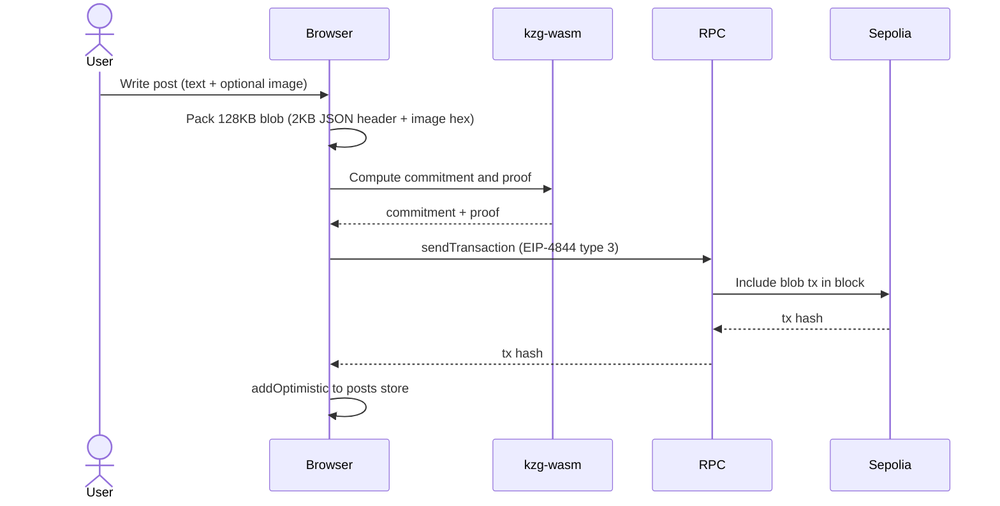
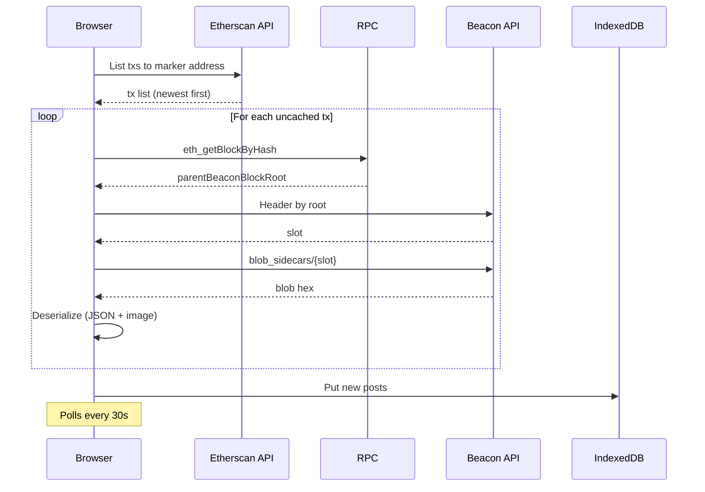

# blobchan

On-chain 4chan — posts live in EIP-4844 blobs. Immutable, Censorship-resistant, Permissionless.

## Description
Blobchan is a fully decentralized image board. You connect with WalletConnect, generate a burner posting key, fund it with testnet ETH, and start posting. Every thread and reply is a 128 KB blob transaction on Sepolia — the on-chain imageboard. Posts are publicly readable by anyone.

## How it's made

### Posting (browser → blob)

1. User connects their wallet, generates a dedicated burner posting key, and funds it with ETH. This key is required because no browser wallets support signing EIP-4844 (blob) transactions directly.
2. User writes a post (text + optional WebP image, compressed to ~122 KB)
3. Browser computes a **KZG commitment and proof** over the 128 KB blob using `kzg-wasm` (C-KZG compiled to WebAssembly)
4. Viem constructs and signs a **Type 3 (EIP-4844) transaction** with the blob sidecar using the burner key, then sends it to a fixed marker address (`0x...b10b`)
5. Post structure: first 2048 bytes = JSON metadata (board, threadId, name, content, timestamp), remaining bytes = hex-encoded image
6. Gas cost: ~0.0001 ETH per post on Sepolia

### Reading (blockchain → browser)

1. **Etherscan V2 API** lists all transactions sent to the marker address
2. For each uncached tx, **eth_getBlockByHash** retrieves the `parentBeaconBlockRoot`
3. **Beacon API** (`ethereum-sepolia-beacon-api.publicnode.com`) looks up the beacon header by root, gets the slot, fetches blob sidecars
4. Blob hex is decoded: null-terminated JSON header at offset 0, hex image at offset 2048
5. Posts are cached in IndexedDB — cached tx hashes are skipped on subsequent refreshes to save API credits
6. Polls every 30 seconds for new content

### Stack

- **SvelteKit** + static adapter → Cloudflare Pages
- **WalletConnect** via @reown/appkit + wagmi adapter
- **Viem** for all chain interactions (send, sign, query)
- **kzg-wasm** for KZG commitments (required by EIP-4844)
- **Public RPC & Beacon API** (publicnode.com) — no paid infrastructure
- **Etherscan V2 API** (free tier) for transaction discovery
